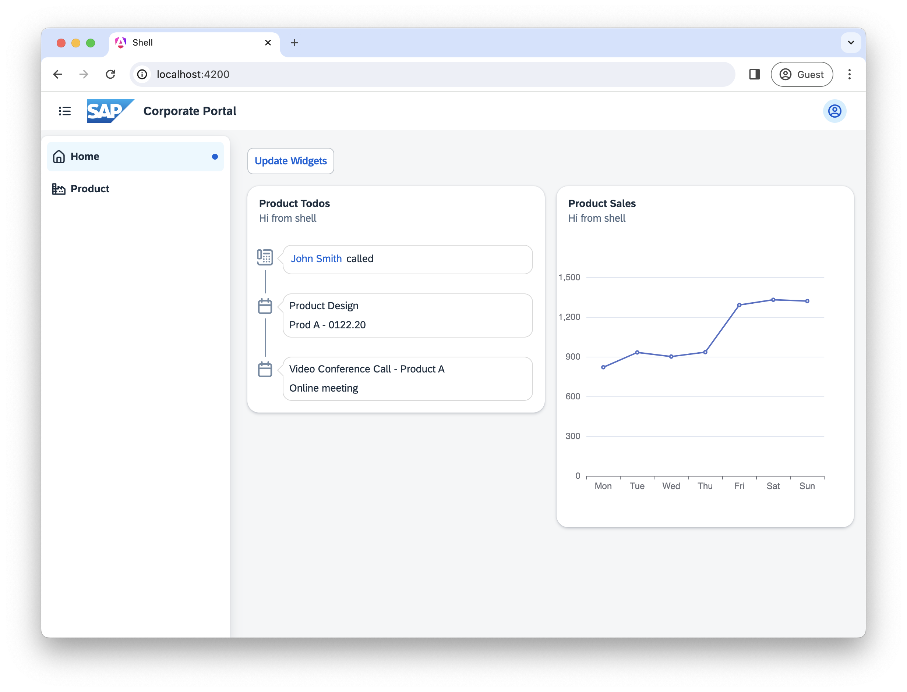
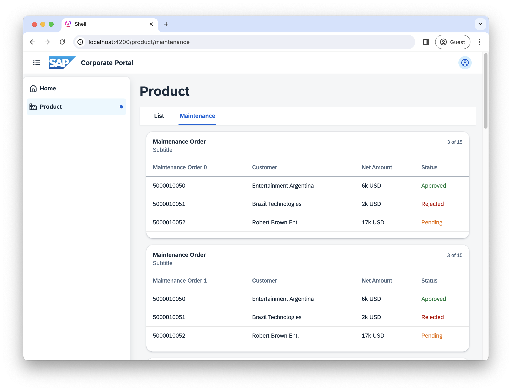
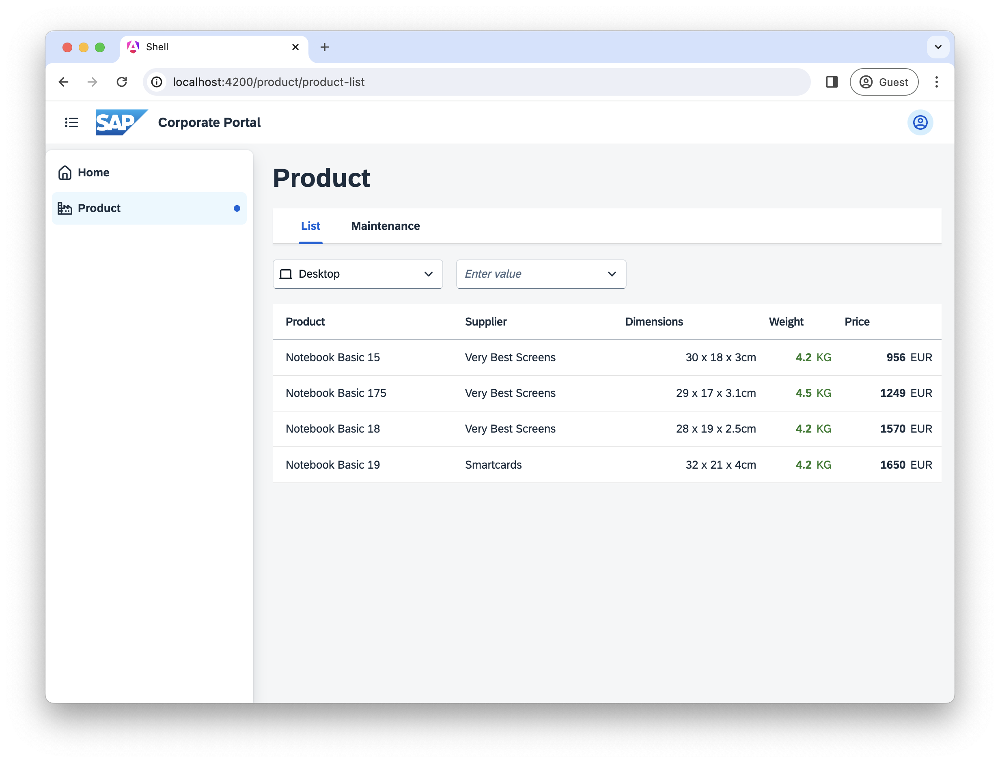

# Microfrontends
This repo showcases the use of micro frontends with module federation and web components. Read the following articles for more in depth know-how:
- https://www.angulararchitects.io/blog/module-federation-with-angulars-standalone-components/
- https://www.angulararchitects.io/blog/multi-framework-and-version-micro-frontends-with-module-federation-your-4-steps-guide/
- https://www.angulararchitects.io/blog/getting-out-of-version-mismatch-hell-with-module-federation/
- https://github.com/edumserrano/webpack-module-federation-with-angular/blob/main/code-demos/component-directive-ng16/shell-ng16/src/app/load-remote-component.directive.ts

<div style="display: flex; flex-wrap: wrap;">
    
    
    
</div>


## Analysis
TBD

## Dev Guide: Loading federated modules
Prerequisites: Set up the webpack shell to consume the federated modules.
```js
// webpack.config.js
const {shareAll, withModuleFederationPlugin} = require("@angular-architects/module-federation/webpack");

module.exports = withModuleFederationPlugin({
  remotes: {
    "product": "http://localhost:4201/remoteEntry.js"
  },
});
```

### Angular

#### Router Modules
Load a router module by referencing the remote
```js
// app.routes.ts
export const routes: Routes = [
  {
    path: 'product',
    loadChildren: () => import('product/routes').then(m => m.routes)
  }
];
```

Alternative: Load a router module with dynamic config
```js
// app.routes.ts
{
    path: 'product',
    loadChildren: () =>
        loadRemoteModule({
            type: 'module',
            remoteEntry: 'http://localhost:4201/remoteEntry.js',
            exposedModule: './routes'
        }).then(m => m.routes)
}
```

#### Components
Load a component by referencing the remote
```js
// some.component.ts
const m = await import('product/chart');
this.viewContainer.clear();
this.viewContainer.createComponent(m.ChartComponent);
```

Alternative: Load a component module with dynamic config
```js
// some.component.ts
const m = await loadRemoteModule({
    type: 'module',
    remoteEntry: 'http://localhost:4201/remoteEntry.js',
    exposedModule: './chart'
});
```

### Web Components
The web components are added programmatically via module federation. See https://www.npmjs.com/package/@angular-architects/module-federation-tools?activeTab=readme for more details on the library used.
```html
<mft-wc-wrapper [options]="item" [props]="..." [events]="..."></mft-wc-wrapper>
```

```js
// some.component.ts
item: WebComponentWrapperOptions = {
  remoteEntry: 'http://localhost:4202/remoteEntry.js',
  remoteName: 'productComponent',
  exposedModule: './timeline',
  elementName: 'mf-timeline'
}
```


